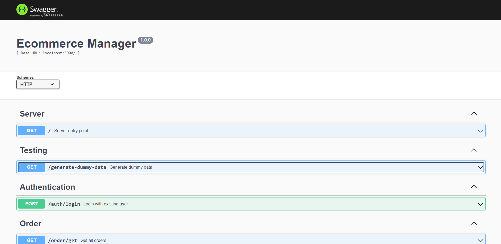
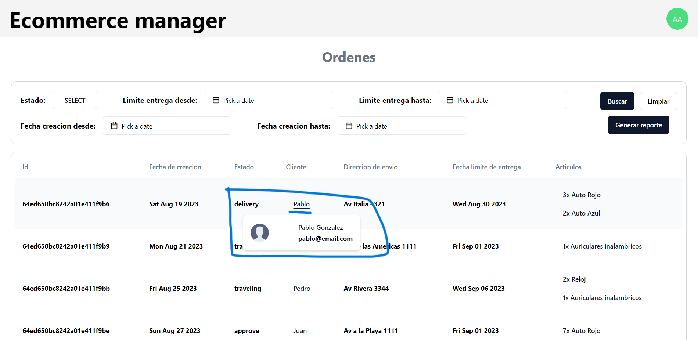
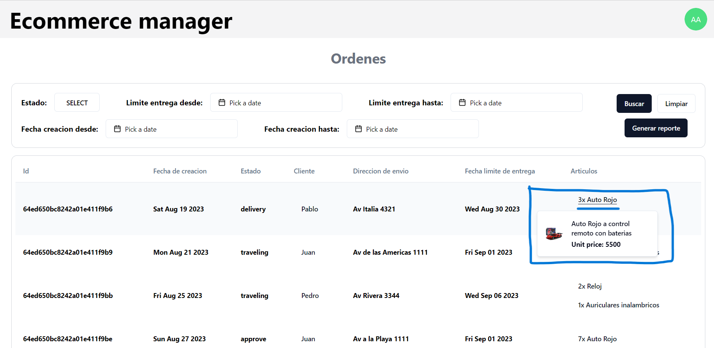

## Ecommerce manager

### React application with a NodeJS backend and a MongoDB database

Project structure:
```
.
├── backend
│   ├── src
│   │   ├── auth
│   │   ├── order
│   │   │   ├── application
│   │   │   ├── data
│   │   │   ├── domain
│   │   │   └── infraestructure
│   │   ├── item
│   │   ├── ...
│   │   └── user
│   ├── Dockerfile
│   ...
├── frontend
│   ├── data
│   ├── domain
│   ├── components
│   ├── pages
│   ├── stores
│   ├── ...
│   └── Dockerfile
├── compose.yaml
└── README.md

```

## Run the Docker image
### Build the backend
```
cd .\backend\
npm install
npm run build
```

### Build the frontend
```
cd .\frontend\
npm install
npm run build
```

### Execute the Docker images
```
docker compose up -d
```

## Backend Docs endpoint
- http://localhost:3000/api-docs


## Frontend images
- http://localhost:3001
```
email: admin@email.com
password: admin1234
```


